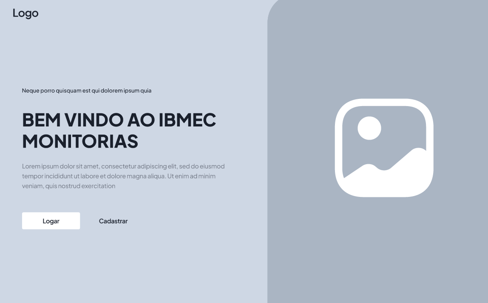
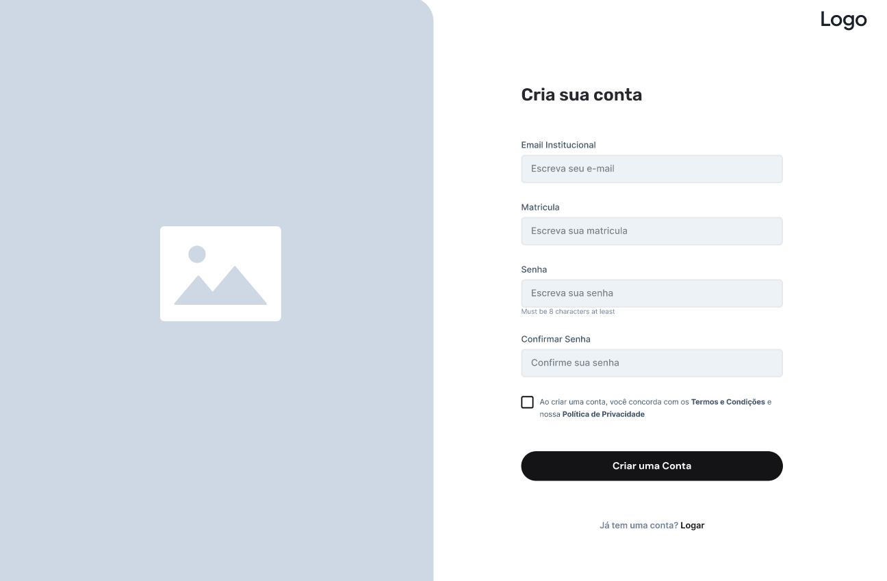
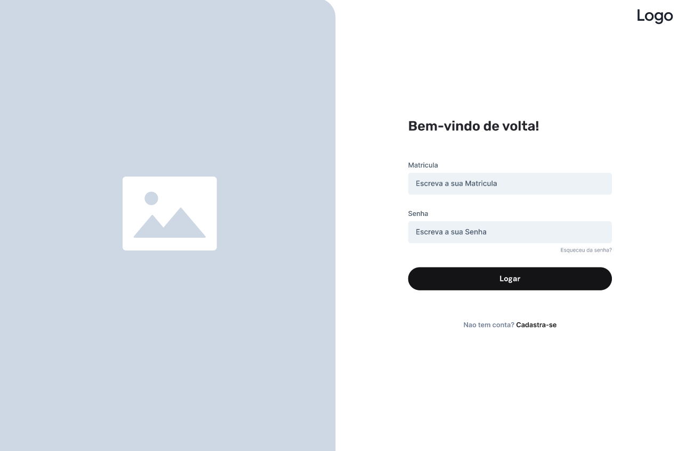
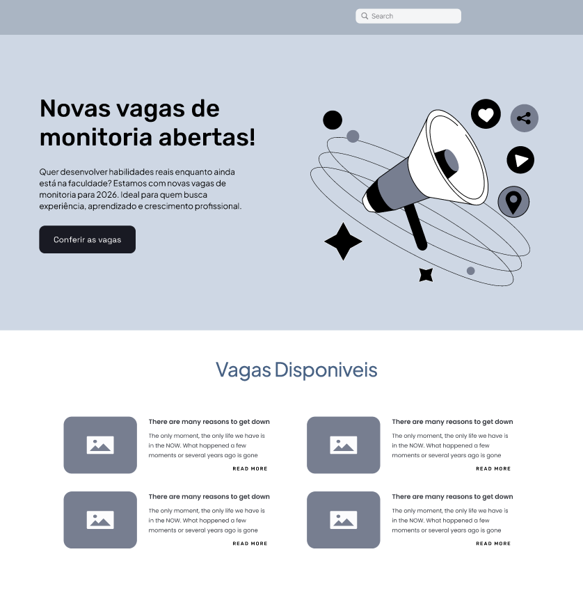
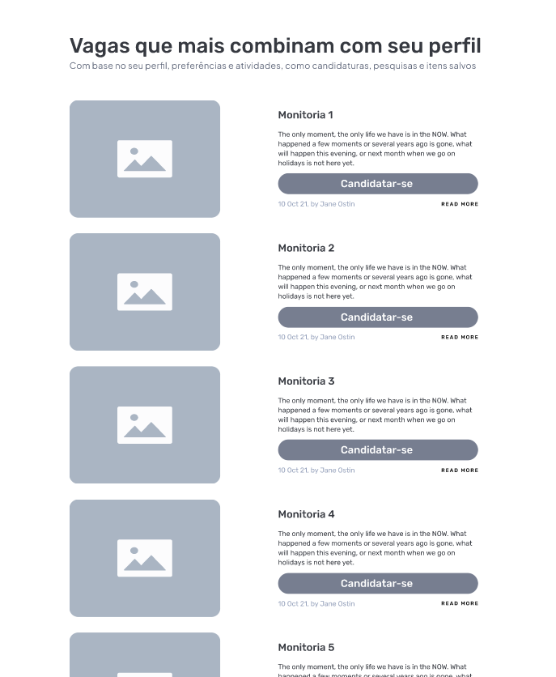
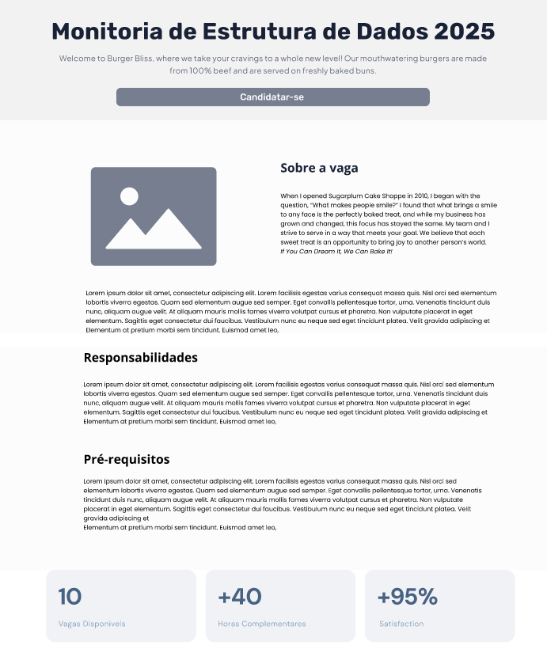
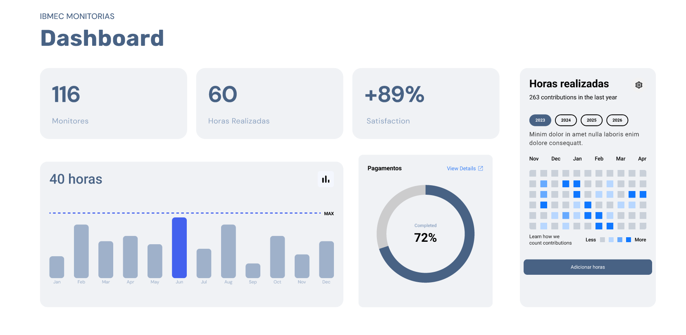
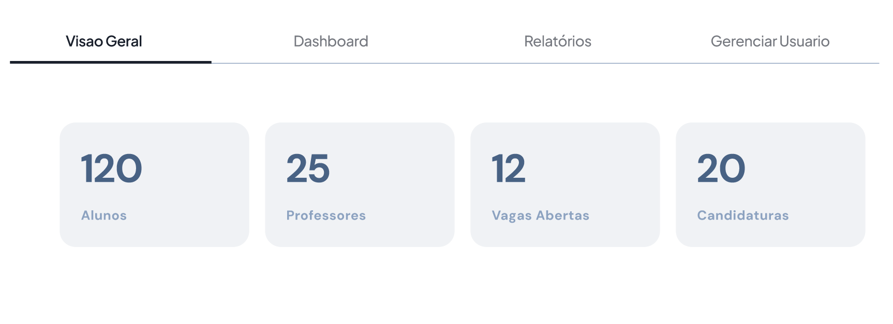
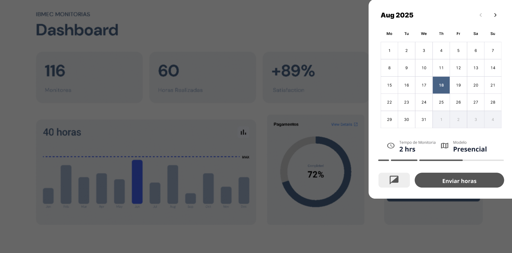
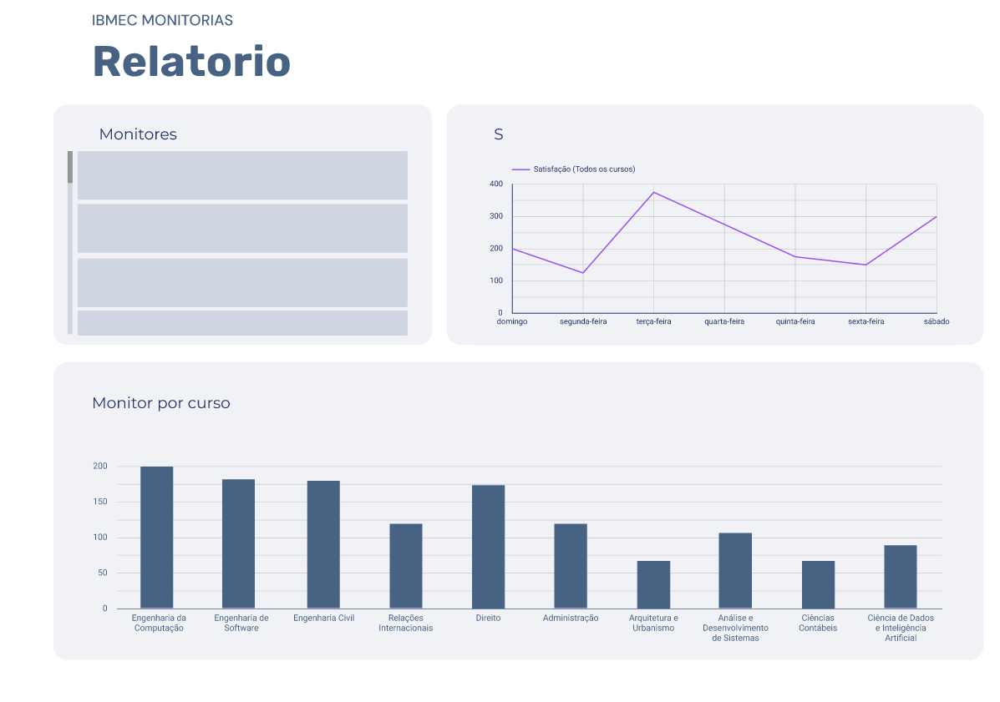

## Introdução

A construção do protótipo de alta fidelidade auxilia a equipe de desenvolvimento a encontrar um nível de detalhes abrangentes, extrair funcionalidades, testar usabilidade, e também fornece uma base para o gerenciamento do projeto pois com o protótipo é possível realizar estimativas de quanto tempo será necessário desempenhar em cada funcionalidade.

## Metodologia

O projeto teve início com os levantamentos preliminares realizados pela equipe, visando compreender as necessidades e objetivos da solução. Após uma série de discussões e análises, optamos pela utilização da ferramenta Figma para o desenvolvimento do protótipo de baixa fidelidade, permitindo uma visualização inicial da interface e facilitando ajustes colaborativos.

---

### Tela Inicial

### Tela Criar a conta

### Tela Login 

### Tela do Aluno

### Tela Vagas da Monitoria

### Tela Monitoria Especifica

### Tela Dashboard

### Tela do Admin

### Tela Adicionar horas adicionais

### Tela Relatorio

---

## Conclusão

A partir da elaboração do protótipo foi possível ter uma noção inicial da interface do usuário, definindo fluxo, paleta de cores, botões, app bars e diversas outras funcionalidades

## Autor(es)

| Data     | Versão | Descrição                            | Autor(es)                                                                            |
| -------- | ------- | -------------------------------------- | ------------------------------------------------------------------------------------ |
| 17/09/25 | 1.0     | Criação do documento e Figma         | Felipe Siaba          |                                     |

